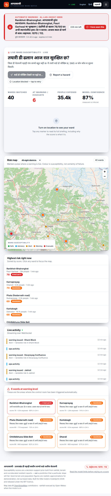
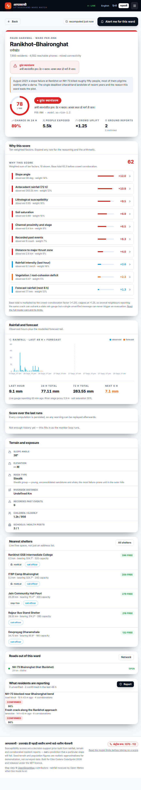
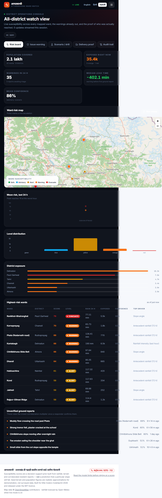

<div align="center">

# आपतसाथी · AapaatSathi

**Ward-level landslide & flash-flood early warning for Uttarakhand's hill districts.**

*Warn the ward, ring the phone — in the language people actually speak.*

[](LICENSE)
[](backend/requirements.txt)
[](frontend/tsconfig.json)
[](backend/tests)
[](backend/scripts/smoke_test.py)

</div>

---

A district-level "red alert" is not a warning for a hillside.

When IMD and the SDMA issue a red alert for Pauri Garhwal, they are addressing
6,81,400 people across 5,438 km². The forty families living below the escarpment
at Ranikhot — where a single slope failure in August 2021 killed around fifty
worshippers — get a message that tells them nothing about whether *their* slope
is going to move tonight.

**AapaatSathi warns at ward level, and delivers by SMS and automated voice call in
English, Hindi and Garhwali** — because the households most exposed to slope
failure are the least likely to be holding a charged smartphone with data
reaching them.

It is a full-stack, open-source MVP built for [Elite Coders CodeSprint
2026](https://codesprint-by-elitecoders.devpost.com): FastAPI + SQLAlchemy async
+ Pydantic v2 behind React 18 + TypeScript + MapLibre, with a live WebSocket
watch-room.

---

## What it actually does

| Surface | Who | What they get |
|---|---|---|
| **Citizen map** | any resident, no account needed | live risk for their ward, why that score, one-tap hazard report with photo, nearest shelter with *real free space*, which roads are still open |
| **Field responder queue** | GRSO / NDRF / PWD on the ground | triage queue ordered by evidence, confirm / dismiss / dispatch, road and shelter updates — each verdict retrains reporter trust |
| **District console** | the control room | risk board, author and broadcast warnings with a three-language proofread step, retune the model, run what-if drills, and prove exactly who was reached |

### The three ideas worth stealing

1. **An explainable score, not a black box.** Ten weighted factors — four
   dynamic (rain intensity, 72 h antecedent rain, soil saturation, 6 h forecast)
   and six terrain priors — each a published piecewise interpolation, weights
   summing to 1.0, and the full per-factor contribution persisted on every run.
   An inquiry can see *why* a ward scored 87 at 2am.
   [`docs/adr/0001`](docs/adr/0001-transparent-model-not-ml.md) explains why this
   is not a neural network, and why pretending otherwise would be dishonest.
2. **A bounded crowd multiplier.** Corroborated resident reports scale a ward's
   score, capped at ×1.25. Three neighbours reporting the same fresh crack inside
   an hour outrank a stale rain gauge; one excited WhatsApp forward cannot push a
   district into evacuation.
3. **Warnings on transition, not on state.** Alerts fire when a ward *crosses* a
   level, with a dedupe window. This is the difference between a system people
   act on and one they mute by the third week of the monsoon.

---

## Quickstart

Two terminals, no Docker, no API keys, no database server.

```bash
# 1 — API on :8000  (creates and seeds SQLite on first boot)
cd backend
python -m venv .venv && source .venv/bin/activate   # Windows: .venv\Scripts\activate
pip install -r requirements.txt
uvicorn app.main:app --reload
```

```bash
# 2 — web on :5173
cd frontend
npm install
npm run dev
```

Open **http://localhost:5173** · interactive API at **http://localhost:8000/docs**

Windows users can run both at once with
`powershell -ExecutionPolicy Bypass -File .\scripts\dev.ps1`.

### Production Deployment with Docker

To run the application in a production-ready environment, you can use Docker Compose:

```bash
docker compose up --build
```

This will build and start the backend on port 8000 and the frontend on port 4173.

<details>
<summary><strong>If <code>import sqlalchemy.ext.asyncio</code> fails with "An Application Control policy has blocked this file"</strong></summary>

<br/>

That is Windows Smart App Control / WDAC refusing the freshly downloaded
`_greenlet.pyd` that SQLAlchemy's async engine needs. It is a machine policy,
not a project bug — the same package installed into your system Python is
allowed. Repair the virtualenv by copying the trusted copy into it:

```powershell
# stop any running API first, then:
powershell -ExecutionPolicy Bypass -File .\scripts\fix-greenlet.ps1
```

Alternatively create the venv outside a managed folder, or install greenlet from
source. Nothing in the application changes either way.

</details>


### Demo accounts

All use the password `Aapaat@2026`:

| role | account | can do |
|---|---|---|
| system admin | `admin.demo@aapaatsathi.in` | everything, all districts, audit trail |
| district admin | `collector.demo@aapaatsathi.in` | Dehradun only — issue and broadcast warnings |
| field responder | `field.demo@aapaatsathi.in` | Pauri Garhwal — verify reports, close roads |
| citizen | `citizen.demo@aapaatsathi.in` | Ranikhot resident on Garhwali SMS |

### Try this in ninety seconds

1. Open `/` — the map shows 40 real wards across 8 districts, pulsing where a
   warning is live. Click **Ranikhot–Bhaironghat** and expand the factor rows:
   every contribution shows its arithmetic.
2. Sign in as system admin → **District console → Scenario / drill**. Pick a
   quiet ward, hit the **"Ranikhot 2021 replay"** preset, tick *actually run the
   escalation path*, and watch a green ward go orange and a warning broadcast
   itself live — no page refresh, because it arrived over the WebSocket.
3. Go to **Delivery proof**. The ledger says `simulated`, not `sent`, and says
   so in words. That is deliberate; see below.
4. Open `/model` — the model card, with its limits stated on the page.

---

## Verify an install

```bash
cd backend && pip install -r requirements-dev.txt
python -m pytest -q                 # 276 tests
python scripts/smoke_test.py        # 61 end-to-end checks against a running API
cd ../frontend && npm run typecheck && npm run build
```

CI (`.github/workflows/ci.yml`) runs exactly these four things.

---

## What is simulated, and what is real

This section exists because a disaster tool that oversells itself is worse than
no tool.

**Real and working**

- The scoring engine, escalation logic, dedupe, alert authoring, delivery
  ledger, audit trail, role enforcement, report corroboration and trust
  feedback — all implemented, all under test.
- Ward geography: 40 named wards on real coordinates in 8 real districts.
- Localisation: every outbound message renders in English, Hindi and Garhwali,
  resolved per recipient, with voice (IVR) attempted only at orange and red.
- Twilio and MSG91 adapters are real REST implementations, activated by setting
  credentials.

**Simulated by default — and labelled as such everywhere**

- **Telemetry.** A deterministic monsoon simulator generates rainfall unless
  `USE_LIVE_WEATHER=true`, which switches to Open-Meteo. Every row carries
  `source = simulated | open-meteo | scenario`, so a drill can never be read as
  an observation. The simulator is a feature: a reviewer at 2am with no network
  gets the same reproducible monsoon as anyone else.
- **Delivery.** `SMS_PROVIDER=console` is the default: it logs and records
  `simulated`, contacts nobody, costs nothing. Missing credentials fall back to
  console with a warning rather than throwing mid-broadcast.
- **Terrain and population priors.** Slope, lithology, NDVI, fault proximity and
  population in `backend/app/seed.py` are realistic engineering approximations
  assembled for a working demo. **They are not surveyed data** and must be
  replaced with GSI / Survey of India / Bhuvan / State DGRRM layers before any
  operational use.

**Not claimed at all**

- No accuracy, precision/recall or AUC figure. There is no ward-level,
  temporally aligned Uttarakhand event dataset to compute one against, so any
  such number would be invented. The model card says this out loud.
- No deployment, no users, no government partnership.

Full disclosure, including AI assistance, is in
[`submission/AI_AND_THIRD_PARTY_DISCLOSURE.md`](submission/AI_AND_THIRD_PARTY_DISCLOSURE.md).

---

## Architecture

```
frontend/  React 18 + TS + Vite + Tailwind + MapLibre + recharts
   │  REST /api/v1  +  WebSocket /api/v1/ws  (public | ops)
backend/   FastAPI + SQLAlchemy 2 async + Pydantic v2
   ├─ services/risk_engine.py   10-factor transparent susceptibility model
   ├─ services/alerts.py        escalation on level transition, dedupe, broadcast
   ├─ services/notifier.py      console / twilio / msg91 adapters + ledger
   ├─ services/ingest.py        Open-Meteo adapter + deterministic monsoon
   ├─ services/assembly.py      one shared definition of "current risk"
   └─ seed.py                   8 districts · 40 wards · 51 gauges · 18 shelters
                                18 road segments · 12 resource units
data       SQLite by default · Postgres via DATABASE_URL · no PostGIS
```

Details and reasoning: [`docs/ARCHITECTURE.md`](docs/ARCHITECTURE.md) and the
[ADRs](docs/adr/). The database choice is in
[`adr/0002`](docs/adr/0002-sqlite-default-no-postgis.md), the delivery ledger in
[`adr/0003`](docs/adr/0003-simulated-delivery-ledger.md).

**54 API operations** across auth, geography, risk, alerts, reports, shelters,
roads, resources, notifications, analytics, subscriptions and a live WebSocket.
`GET /api/v1/risk/model` returns the published weights and thresholds;
`GET /api/v1/meta` returns the label catalogue so the frontend hard-codes
nothing.

### Security posture

bcrypt with a SHA-256 pre-hash (so a Devanagari passphrase is not silently
rejected — that was a real bug we found and fixed). Short-lived access JWTs plus
refresh tokens, with `typ` enforced so a refresh token cannot be used as a
bearer credential. Four roles, and **self-registration always produces a
citizen** regardless of what the payload claims. District admins are scoped to
their own district on alerts, sweeps and drills. Reporter identity never appears
on a public feed; phone numbers are masked in list views; the public WebSocket
channel carries no personally identifying data. See
[`SECURITY.md`](SECURITY.md).

---

## Screenshots

Phone-width captures, which is where a resident actually sees this.

| Citizen risk map | Ward briefing with factor waterfall | District console |
|---|---|---|
|  |  |  |

---

## Roadmap: what would make this deployable

In rough order of value:

1. **Replace the seeded priors** with GSI National Geomorphoscape, a surveyed
   DEM, Sentinel-2 NDVI anomalies and Census ward-level population. The
   `data-integration` issue template is written for exactly this task.
2. **Calibrate thresholds per district** against recorded events with a district
   engineer, rather than shipping one national cut-off.
3. **Cell broadcast and community radio hooks**, because the households at
   greatest risk are the ones no app reaches.
4. **Offline-first citizen PWA** with a cached ward tile set — hill connectivity
   fails exactly when the warning matters most.
5. **Kumaoni, Nepali and Lepcha** localisation. The catalog is a dictionary; a
   native speaker reviewing the Garhwali strings is worth more than any code
   change here.
6. **A learned residual** on top of this prior, once the append-only
   `ward_risks` and verified-report tables have accumulated a monsoon or two of
   real labels.

## Contributing

Read [`CONTRIBUTING.md`](CONTRIBUTING.md) first — it lists the design rules
worth knowing before you touch anything, and the five things that would help
most right now. Issues and PRs are welcome, including from the districts this is
meant for.

## Licence

[MIT](LICENSE). Third-party data and libraries carry their own terms, including
OpenStreetMap attribution (rendered by MapLibre and not removable) and the
Open-Meteo non-commercial licence.

## Built for

Elite Coders CodeSprint 2026 · build phase 15 Oct – 15 Nov 2026 · final pitch
22 November 2026, Dehradun, Uttarakhand.

---

<div align="center">

*If you are in danger in the Uttarakhand hills right now, do not read this
repository — call **112** (national emergency) or **1070** (Uttarakhand disaster
control room).*

</div>
